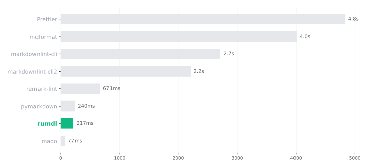

# Comparison with Other Markdown Tools

This page compares rumdl with other Markdown linters and formatters. The goal is to help you evaluate which tool fits your workflow, not to declare a winner.

> **Last verified: February 2026.** Tool capabilities change over time. If you notice an inaccuracy, please [open an issue](https://github.com/rvben/rumdl/issues).

For detailed comparisons with specific tools, see:

- [Comparison with markdownlint](markdownlint-comparison.md) — rule compatibility, migration guide, behavioral differences
- [Comparison with mdformat](mdformat-comparison.md) — formatting capabilities, plugin vs flavor approach

## Overview

| Tool                  | Type          | Language | Rules             | Auto-fix | Flavors | Config format           | Plugins      | LSP |
| --------------------- | ------------- | -------- | ----------------- | -------- | ------- | ----------------------- | ------------ | --- |
| **rumdl**             | Lint + Format | Rust     | 71                | Yes      | 6       | TOML, JSON, YAML        | No           | Yes |
| **markdownlint-cli**  | Lint          | Node.js  | 53                | Yes      | No      | JSON, JSONC, YAML, TOML | Yes (JS)     | No  |
| **markdownlint-cli2** | Lint          | Node.js  | 53                | Yes      | No      | JSONC, YAML, JS         | Yes (JS)     | No  |
| **remark-lint**       | Lint          | Node.js  | ~80 (via presets) | No       | No      | JS, JSON, YAML          | Yes (JS)     | No  |
| **pymarkdown**        | Lint          | Python   | 46                | Yes      | No      | JSON, YAML, TOML        | Yes (Python) | No  |
| **mdformat**          | Format        | Python   | N/A               | N/A      | No      | TOML                    | Yes (Python) | No  |
| **mado**              | Lint          | Rust     | 38                | No       | No      | TOML                    | No           | No  |
| **Prettier**          | Format        | Node.js  | N/A               | N/A      | No      | JSON, YAML, JS          | Yes (JS)     | No  |

## Linting Capability

**markdownlint-cli / markdownlint-cli2** share the same rule engine (53 rules). markdownlint-cli2 adds JSONC config and tighter VS Code integration. Both support custom rules written in JavaScript.

**remark-lint** takes a different approach: rules are distributed as individual npm packages, composed into presets. The `remark-preset-lint-recommended` and `remark-preset-lint-consistent` presets
cover common cases. No built-in auto-fix for lint violations (remark itself can transform Markdown, but lint rules only report).

**pymarkdown** implements 46 rules with its own GFM-compliant parser. It supports auto-fix and custom rule extensions in Python.

**mado** is a Rust-based linter with 38 rules (33 stable, 5 unstable). It has no auto-fix and no plugin system.

**rumdl** implements all 53 markdownlint rules plus 18 additional rules (71 total). It supports auto-fix for most rules and includes rules not found in other tools, such as relative link validation
(MD057), footnote checks (MD066-MD068), nested code fence detection (MD070), and TOC validation (MD073).

## Formatting Capability

**Prettier** is a widely adopted opinionated formatter. Its Markdown support normalizes whitespace, list markers, and emphasis style with minimal configuration. It does not lint.

**mdformat** is a Python formatter focused on producing consistent CommonMark output. Extended syntax (GFM tables, frontmatter) is supported through plugins.

**rumdl** provides formatting through `rumdl fmt` (formatter mode, always exits 0) and `rumdl check --fix` (linter mode, exits 1 if unfixable violations remain). It also supports `--diff` to preview
changes before applying them.

markdownlint-cli, markdownlint-cli2, and pymarkdown can fix certain lint violations but are not general-purpose formatters.

## Flavor and Dialect Support

Most tools treat Markdown as a single dialect and rely on configuration or plugins to handle extended syntax.

**rumdl** has built-in flavor support that adjusts rule behavior for specific documentation systems:

| Flavor   | Target system      | Example adjustments                                    |
| -------- | ------------------ | ------------------------------------------------------ |
| standard | CommonMark + GFM   | Baseline behavior (GFM extensions included by default) |
| mkdocs   | MkDocs / Material  | Admonitions, tabs, mkdocstrings                        |
| mdx      | MDX                | JSX components, ESM imports                            |
| obsidian | Obsidian           | Callouts, wikilinks, Dataview                          |
| quarto   | Quarto / RMarkdown | Citations, shortcodes, executable blocks               |
| kramdown | Jekyll / kramdown  | Attribute lists, TOC markers                           |

Note: `gfm`, `github`, and `commonmark` are accepted as aliases for `standard` since the parser includes GFM extensions by default.

Flavors can be set globally or per-file pattern:

```toml
[global]
flavor = "mkdocs"

[per-file-flavor]
"**/*.mdx" = "mdx"
```

## Editor Integrations

| Tool                  | VS Code                    | Neovim           | LSP                        | Watch mode      |
| --------------------- | -------------------------- | ---------------- | -------------------------- | --------------- |
| **rumdl**             | Yes (built-in)             | Yes (via LSP)    | Yes (`rumdl server`)       | Yes (`--watch`) |
| **markdownlint-cli**  | Via markdownlint extension | Via efm/null-ls  | No                         | No              |
| **markdownlint-cli2** | Yes (vscode-markdownlint)  | Via efm/null-ls  | No                         | No              |
| **remark-lint**       | Via remark extension       | Via LSP/efm      | Via remark-language-server | No              |
| **pymarkdown**        | No                         | No               | No                         | No              |
| **mdformat**          | Via extension              | Via conform.nvim | No                         | No              |
| **mado**              | No                         | No               | No                         | No              |
| **Prettier**          | Yes (Prettier extension)   | Via plugins      | No                         | No              |

## Installation and Runtime

| Tool                  | Runtime required | pip | cargo | npm | Homebrew | Single binary |
| --------------------- | ---------------- | --- | ----- | --- | -------- | ------------- |
| **rumdl**             | None             | Yes | Yes   | Yes | Yes      | Yes           |
| **markdownlint-cli**  | Node.js          | No  | No    | Yes | Yes      | No            |
| **markdownlint-cli2** | Node.js          | No  | No    | Yes | Yes      | No            |
| **remark-lint**       | Node.js          | No  | No    | Yes | No       | No            |
| **pymarkdown**        | Python           | Yes | No    | No  | No       | No            |
| **mdformat**          | Python           | Yes | No    | No  | Yes      | No            |
| **mado**              | None             | No  | No    | No  | Yes      | Yes           |
| **Prettier**          | Node.js          | No  | No    | Yes | Yes      | No            |

## Performance

Cold start benchmark on the Rust Book (478 Markdown files), measured with [hyperfine](https://github.com/sharkdp/hyperfine). All tools invoked via `npx`/`uvx` or native binary — no global installs.

| Tool                    | Type   | Mean   | vs rumdl |
| ----------------------- | ------ | ------ | -------- |
| **mado**                | Lint   | 77 ms  | 0.4x     |
| **rumdl**               | Lint   | 217 ms | 1.0x     |
| **pymarkdown**          | Lint   | 240 ms | 1.1x     |
| **remark-lint**         | Lint   | 671 ms | 3.1x     |
| **markdownlint-cli2**   | Lint   | 2.2 s  | 10.2x    |
| **markdownlint-cli**    | Lint   | 2.7 s  | 12.5x    |
| **mdformat**            | Format | 4.0 s  | 18.5x    |
| **Prettier**            | Format | 4.8 s  | 22.3x    |



> **Methodology:** Cold start (no application cache), warm OS disk cache after warmup. rumdl uses `--no-cache`. Node.js tools run via `npx`, Python tools via `uvx`. Measured on Apple M1 Pro. Last run:
> February 2026.
>
> Reproduce: `make benchmark` (requires hyperfine, Node.js, Python).

**Notes:**

- **mado** is faster in cold-start benchmarks because it does less work per file: fewer rules (38 vs 71), no fix generation, and no flavor detection.
  The gap reflects feature surface area, not implementation quality.
- **rumdl** supports result caching (`rumdl check` without `--no-cache`), which skips unchanged files on subsequent runs — typically under 50 ms, faster than mado's cold start.
- **pymarkdown** performs well for a Python tool due to its efficient scanner architecture.
- **Node.js tools** incur interpreter startup overhead. markdownlint-cli2 is faster than markdownlint-cli due to its async architecture.
- **Formatters** (Prettier, mdformat) do more work per file than linters, which partly explains their longer times.

## See Also

- [Comparison with markdownlint](markdownlint-comparison.md) — detailed rule-by-rule comparison and migration guide
- [Comparison with mdformat](mdformat-comparison.md) — formatting feature comparison and migration guide
- [Rules Reference](RULES.md) — complete list of rumdl's 71 rules
- [Markdown Flavors](flavors.md) — flavor configuration and per-rule adjustments
